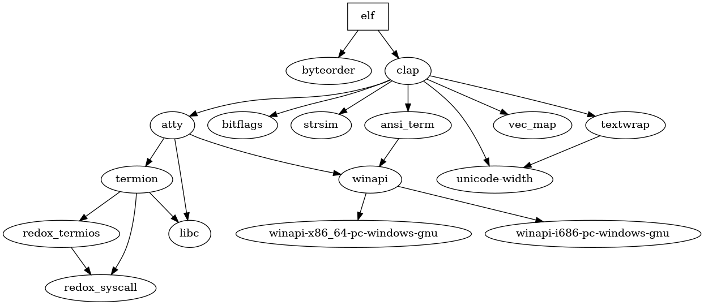

# ELF

## Overview
A `Rust` library to facility programmatic and command line handling of binary files in `ELF` format. Work in progress.

## Dependencies

Graph created with [cargo deps](https://github.com/m-cat/cargo-deps).

## License
All code in this repository is licensed under a permissive MIT license (which can be read [here](./LICENSE.md)), dependencies might have other licenses, though.
